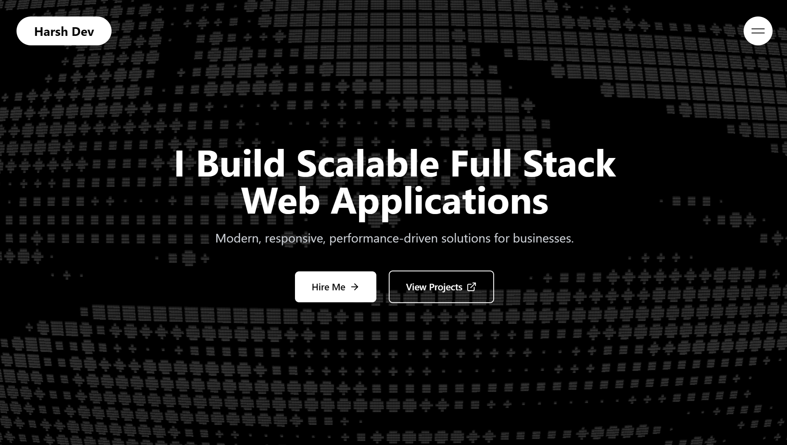

# 🚀 Harsh Rathod - Full Stack Developer Portfolio

<div align="center">
  
  
  [](https://harsh-rathod-portfolio.vercel.app)
  [](https://github.com/panduthegang)
  [](https://www.linkedin.com/in/harsh-rathod-2591b0292/)
  
  **Modern • Responsive • Performance-Optimized**
</div>

---

## 🎯 About

Welcome to my personal portfolio! I'm **Harsh Rathod**, a passionate Full Stack Developer who builds scalable, modern web applications. This portfolio showcases my journey, projects, and achievements in the world of web development.

### ✨ What Makes This Portfolio Special

- 🎨 **Modern Design**: Clean, minimalist black & white aesthetic
- 🚀 **Performance Optimized**: Adaptive rendering based on device capabilities
- 📱 **Fully Responsive**: Seamless experience across all devices
- 🎭 **Interactive Animations**: GSAP-powered smooth animations
- 🖥️ **Terminal Background**: Custom WebGL terminal effect
- 🎪 **Bubble Navigation**: Unique floating navigation menu
- ⚡ **Lightning Fast**: Optimized for speed and accessibility

---

## 🛠️ Tech Stack

### Frontend
- **React 18** - Modern UI library
- **TypeScript** - Type-safe development
- **Tailwind CSS** - Utility-first styling
- **GSAP** - Professional animations
- **Lenis** - Smooth scrolling

### Graphics & Effects
- **OGL** - Lightweight WebGL library
- **Custom Shaders** - Terminal background effects
- **Performance Detection** - Adaptive rendering

### Tools & Deployment
- **Vite** - Lightning-fast build tool
- **ESLint** - Code quality
- **Vercel** - Deployment platform

---

## 🚀 Quick Start

### Prerequisites
- Node.js (v18 or higher)
- npm or yarn

### Installation

1. **Clone the repository**
   ```bash
   git clone https://github.com/panduthegang/Saas-Portfolio
   cd Saas-Portfolio
   ```

2. **Install dependencies**
   ```bash
   npm install
   # or
   yarn install
   ```

3. **Start development server**
   ```bash
   npm run dev
   # or
   yarn dev
   ```

4. **Open your browser**
   ```
   http://localhost:5173
   ```

### Build for Production

```bash
npm run build
# or
yarn build
```

### Preview Production Build

```bash
npm run preview
# or
yarn preview
```

---

## 📁 Project Structure

```
src/
├── components/          # Reusable UI components
│   ├── BubbleMenu.tsx  # Floating navigation menu
│   ├── OptimizedTerminal.tsx  # Performance-aware terminal
│   ├── FaultyTerminal.tsx     # WebGL terminal effect
│   └── ImageCarousel.tsx      # Image carousel component
├── hooks/              # Custom React hooks
│   └── usePerformanceOptimization.ts
├── utils/              # Utility functions
│   └── deviceDetection.ts
├── App.tsx            # Main application component
├── main.tsx          # Application entry point
└── index.css         # Global styles
```

---

## 🎨 Features

### 🖥️ Interactive Terminal Background
- Custom WebGL shader effects
- Performance-adaptive rendering
- Mouse interaction support
- Smooth animations

### 🎪 Bubble Navigation Menu
- Unique floating design
- Smooth GSAP animations
- Mobile-responsive
- Accessible keyboard navigation

### 📊 Performance Optimization
- Device capability detection
- Adaptive animation complexity
- Memory-efficient rendering
- Reduced motion support

### 🎯 Sections
- **Hero** - Eye-catching introduction
- **Services** - Development offerings
- **Projects** - Featured work showcase
- **Achievements** - Awards and recognition
- **Testimonials** - Client feedback
- **Contact** - Get in touch

---

## 🏆 Featured Projects

### 🔍 Verifai
**AI-Powered Fake News Detection Platform**
- React.js, Tailwind CSS, Firebase
- Gemini API integration
- D3.js data visualization
- [Live Demo](https://verifai-by-house-stark.vercel.app)

### 📝 LiveDocs
**Real-time Collaborative Document Editor**
- Next.js, Tailwind CSS
- Liveblocks for real-time collaboration
- Clerk authentication
- [Live Demo](https://livedocs-by-harsh-rathod.vercel.app/sign-in)

### 🛒 SkyStore
**Modern E-commerce Platform**
- Next.js, Tailwind CSS
- Appwrite backend
- Secure authentication
- [Live Demo](https://sky-store-by-harsh-rathod.vercel.app/sign-in)

---

## 🏅 Achievements

- 🥇 **Winner** - Google Developer Group "Code the Cloud Edition"
- 🥈 **Runner-up** - Suprathon by Suprazo Technologies

---

## 📱 Responsive Design

This portfolio is fully responsive and optimized for:
- 📱 Mobile devices (320px+)
- 📟 Tablets (768px+)
- 💻 Desktops (1024px+)
- 🖥️ Large screens (1440px+)

---

## ⚡ Performance Features

- **Lazy Loading** - Images and components load on demand
- **Code Splitting** - Optimized bundle sizes
- **Device Detection** - Adaptive rendering based on capabilities
- **Smooth Scrolling** - Enhanced user experience
- **Accessibility** - WCAG compliant

---

## 🤝 Contributing

While this is a personal portfolio, I welcome suggestions and feedback!

1. Fork the repository
2. Create a feature branch (`git checkout -b feature/amazing-feature`)
3. Commit your changes (`git commit -m 'Add amazing feature'`)
4. Push to the branch (`git push origin feature/amazing-feature`)
5. Open a Pull Request

---

## 📄 License

This project is open source and available under the [MIT License](LICENSE).

---

## 📞 Contact

**Harsh Rathod** - Full Stack Developer

- 📧 Email: [panduthegang@gmail.com](mailto:panduthegang@gmail.com)
- 💼 LinkedIn: [harsh-rathod-2591b0292](https://www.linkedin.com/in/harsh-rathod-2591b0292/)
- 🐙 GitHub: [panduthegang](https://github.com/panduthegang)

---

<div align="center">
  <h3>🎉 Made with ❤️ by Harsh Rathod</h3>
  <p>
    <strong>Building the future, one line of code at a time</strong>
  </p>
  
  ⭐ **Star this repo if you found it helpful!** ⭐
</div>

---
