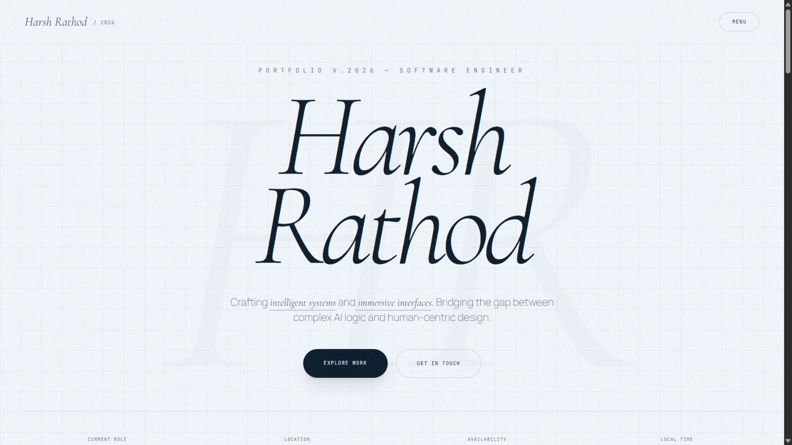

# 🚀 Harsh Rathod - Software Engineer Portfolio

<div align="center">
  
  
  <br />
  
  [](https://harsh-rathod-portfolio.vercel.app)
  [](https://github.com/panduthegang)
  [](https://www.linkedin.com/in/harsh-rathod-2591b0292/)
  
  **Minimalist • Typographic • Performance-Optimized**
</div>

---

## 🎯 About

Welcome to my personal developer portfolio, version 2026. I'm **Harsh Rathod**, a passionate Software Engineering Intern & AI Enthusiast based in Mumbai, India. My goal is crafting intelligent systems and immersive interfaces, bridging the gap between complex AI logic and human-centric design.

### ✨ What Makes This Portfolio Special

- 🎨 **Minimalist Aesthetic**: Clean, professional, and sophisticated typography-focused design.
- 📱 **Fully Responsive**: Seamless layout fluidity across all devices.
- 🎭 **Smooth Animations**: Powered by Framer Motion for elegant view transitions and interactions.
- 🕹️ **Vintage Accents**: Subtle noise overlays and grid backgrounds for an enterprise-grade but creative look.
- ⚡ **Lightning Fast**: Built on modern web standards with Vite and React for snappy response times.

---

## 🛠️ Tech Stack

### Frontend
- **React 18** - UI Architecture
- **TypeScript** - Type-safe development
- **Tailwind CSS** - Utility-first styling
- **Framer Motion** - Fluid animations and gesture interactions
- **Lucide React** - Crisp SVG iconography

### Tooling & Deployment
- **Vite** - Lightning-fast build tool
- **ESLint** - Code quality
- **Vercel** - Deployment platform

---

## 🚀 Quick Start

### Prerequisites
- Node.js (v18 or higher)
- npm or yarn

### Installation

1. **Clone the repository**
   ```bash
   git clone https://github.com/panduthegang/Saas-Portfolio
   cd Saas-Portfolio
   ```

2. **Install dependencies**
   ```bash
   npm install
   ```

3. **Start development server**
   ```bash
   npm run dev
   ```

4. **Navigate to**
   ```
   http://localhost:5173
   ```

---

## 📁 Project Structure

```
src/
├── App.tsx             # Main application and components
├── constants.ts        # Content data (experience, projects, info)
├── index.css           # Global typography, layers, and custom tokens
└── main.tsx            # Application entry point
public/
├── Thumbnail.jpg       # Portfolio Thumbnail
└── ...                 # Project images
```

---

## 🏆 Featured Projects

### 🔍 Verifai
**AI-Powered Fake News Detection Platform**
- Multilingual platform supporting Hindi, Marathi, and Gujarati with 85%+ accuracy.
- Gemini API, React.js, Firebase.

### 💻 Coding Hustlers
**AI-Powered Interview Platform**
- Built intelligent interview practice platform with AI-generated personalized questions.
- React.js, Firebase Auth, Tailwind CSS, Gemini API.

### 🪄 Prompt Craft
**Intelligent UI Component Generator**
- Deep AI Integration with Google Gemini for optimized code generation.
- Live Interactive Renderer in an isolated iframe environment.
- React 19, TypeScript, Tailwind CSS 4, Google Gemini.

---

## 🏅 Achievements

- 🥇 **Winner** - GDG Cloud Hackathon 2025
- 🥈 **Runner-up** - Suprathon All India Virtual Hackathon

---

## 📞 Contact

**Harsh Rathod** - Software Development Intern & AI Enthusiast

- 📧 Email: [harshsrathod959@gmail.com](mailto:harshsrathod959@gmail.com)
- 💼 LinkedIn: [harsh-rathod-2591b0292](https://www.linkedin.com/in/harsh-rathod-2591b0292/)
- 🐙 GitHub: [panduthegang](https://github.com/panduthegang)

---

<div align="center">
  <h3>🎉 Made with ❤️ by Harsh Rathod</h3>
  <p>
    <strong>Crafting intelligent systems and immersive interfaces</strong>
  </p>
  
  ⭐ **Star this repo if you found it helpful!** ⭐
</div>
